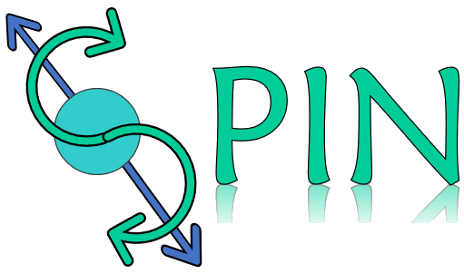

#   :[S]imple [P]ython [I]pywidgets Interface to obtain the optoelectronic properties of [N]anostructures

## Introduction

The Simple Python Ipywidgets Interface to obtain the optoelectronic properties of Nanostructures (SPIN) is an open source graphical user interface which allows user to work with standard SIESTA (Beta version) files and perform end-to-end atomic level simulation processes, that is, it contains the complete flow, from the construction and visualization of structures or systems until the pre-processing, execution, and post-processing of calculations such as structure optimization, electronic properties like band structure and density of states (DOS) and optical properties. SPIN is a easy-to-use and fast-learning solution written in Python and built from Ipywidgets, however the end-user can use all available features without the need for Python language knowledge.

## Install

First step is clone this repository:

    git clone https://github.com/JoseMVergara/SPIN.git

For a correct functioning of the tool it is necessary to have anaconda installed in our computer. Please visit the site and follow the installation instructions according to your operating system. For Windows user's is highly recommended to use Windows Subsystem for Linux - WSL (If you already have Anaconda installed please ignore this step).

    https://docs.anaconda.com/anaconda/install/

Enter the clone folder, run in the terminal (command line):

    cd SPIN

SPIN program is written in Python 3 (>= 3.6). It has  some dependences. It is higly recommended to create a new conda environment with the necessary modules:

    conda create --name spin --file requirements.txt --channel conda-forge/label/cf201901 --channel anaconda --channel conda-forge --channel default 

## Run

Activate conda spin environment:

    conda activate spin

To run the program, please intance a jupyter notebook, run in command line:

    jupyter notebook

then, open and execute [__SPIN_GUI.ipynb__](https://github.com/JoseMVergara/SPIN/blob/main/SPIN-GUI.ipynb).

## Usage

 DFT calculations requires some insight from the user on how the algorithm should treat the problem, e.g, which operators or parameters are appropriate or when is convergence achieved. In the following we shall discuss the different components in calculations in SPIN. This beta version include  the  three  basis  part  of  the SPIN to  do  DFT  calculations employed SIESTA  code, i.e,  Geometric structure, Configure (DFT  parameters) and Calculation (control workflow).

## Description of a geometric structure

The Geometric description has two taps: Structure options and Viewer.

### Structure options:
 Is the tap we will use to generate our first set of atomic coordinates. This tap includes four options:

1. __Upload file:__ Allow us to load external structure files in the formats supported by [Openbabel](https://open-babel.readthedocs.io/en/latest/FileFormats/Overview.html). The program supports the SIESTA file formats *.fdf also.

2. __Create structure manually:__ This is our default option for entering the atomic coordinates and unit cell vectors. Coordinates have to be include in Angstrom units.

3. __Structures predefined:__ Allow us to access the [ase build options](https://wiki.fysik.dtu.dk/ase/ase/build/build.html).

4. __Load created structures:__ This option allows us to load previous built structures.

### Viewer

The viewer is only a preview of the made structure in this beta version.

## Description of  SIESTA  parameters

In this  section  we  can  configure  the DFT parameters  for  SIESTA  calculations. We have  two  options:

__Upload input file :__ In this  option  we  can  reload the  parameters  from  a previous fdf file.  Only  the parameters of the fdf  are  read.

__Create  input file:__ We  can  setup  all  basis  DFT  parameters,  also we  can  defined the  type  of  calculation,  four option  are  predefined.

1. __Relax structure:__ This  option is  mandatory  to  run the  other  calculation,  due that it  create  the  file "label-relaxed.cif" that have  the  equilibrium  structure required  for  bands, DOS and  optical  calculations.

2. __Calculate Bands structure:__ Defined  the option  to  get  the band structure for  periodic  systems.

3. __Calculate  Total  and  Partial Density  of  states:__ We  can  get  the  DOS  and  PDOS,  for  PDOS  this  beta version  do not include  a  processor  to  plot it.

4. __Calculate  Optical properties:__ Defined  the option  to  get  the optical properties for  periodic  systems.

## Description of Control workflow and calculations

This section allows user to select and perform single or multiple calculations.

## Description of Postprocessing component

This section allows user to plot and fully customize graphs results from band strucrure, DOS or optical calculations.

## Examples
There are [some example calculations](https://github.com/JoseMVergara/SPIN/tree/main/examples) given with different usage scenarios. 

## About the project

SPIN project is currently in its __Beta__ version and is open to the general public.

## Licensing
This project is licensed under the terms of the [MIT license](https://opensource.org/licenses/MIT).
